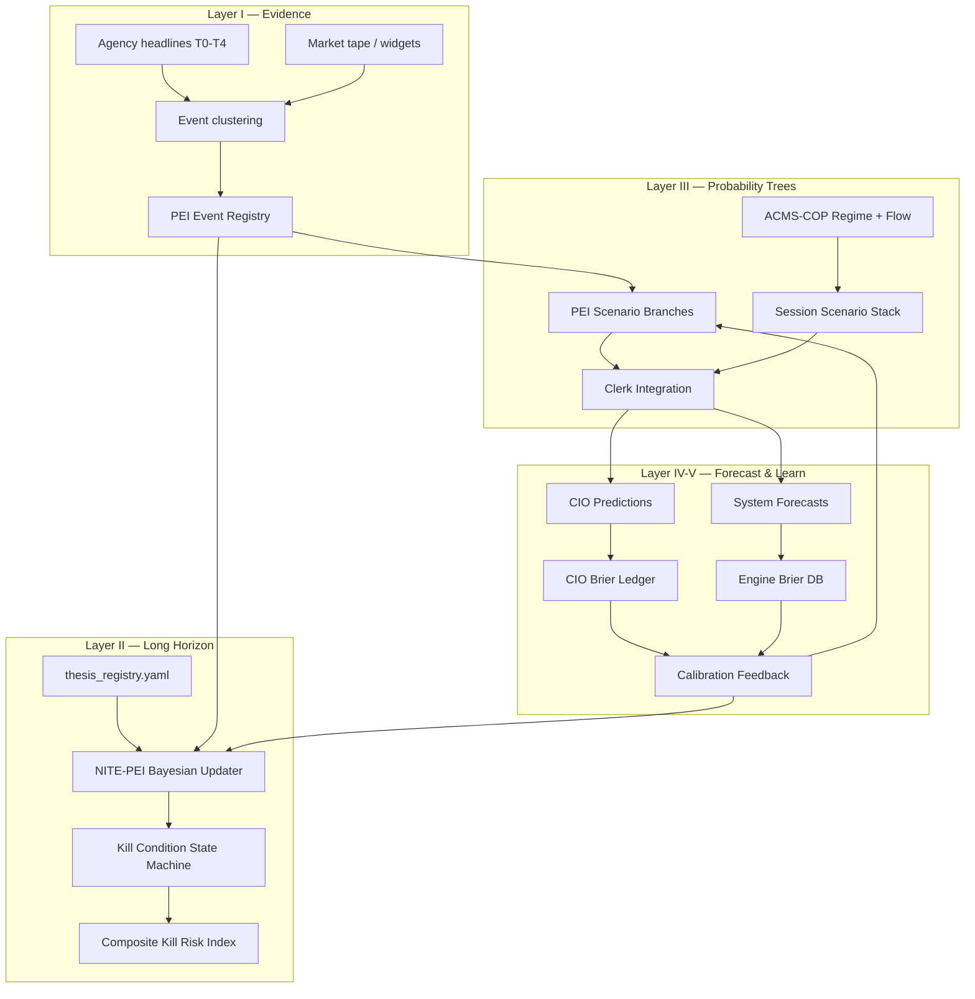
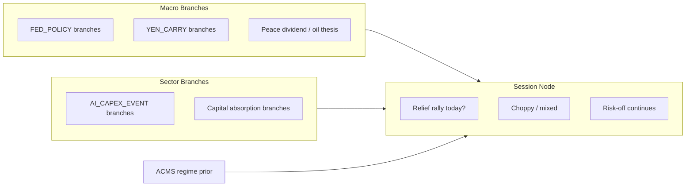
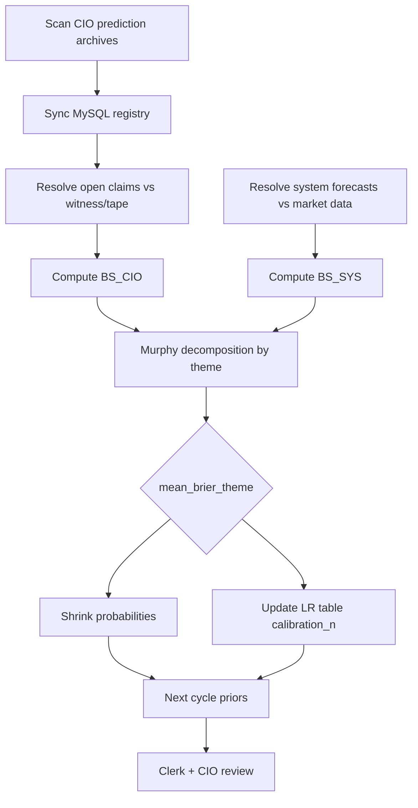

# Probabilistic Market Intelligence by Construction
## A PhD-Level Thesis on Event Extraction, Long-Horizon Thesis Forecasting, ACMS–COP / NITE–PEI Probability Trees, Session Outcome Forecasting, and Dual Brier Learning in BlueLotus V3 (SLICDO)

---

**Author:** Soh Wee Kian — Chief Investment Officer, BlueLotus Fund  
**Institution:** BlueLotus V3 · SLICDO (Self-Learning Institutional Cognitive Digital Organization)  
**Research Support:** Chief Clerk · Chief Strategist · Platform Engineering  
**Date:** 25 June 2026 · Singapore  
**Field:** Probabilistic Forecasting · Event-Driven Finance · Institutional Decision Systems  
**Classification:** BlueLotus Research Series · SLICDO-PEI-ACMS · V3 Doctrine  
**Publication (HTML):** [slicdo-probabilistic-intelligence-thesis-v3.html](https://sohweekian.github.io/bluelotus/slicdo-probabilistic-intelligence-thesis-v3.html) *(GitHub Pages)*  
**Companion Documents:** `BlueLotus_V3_Superforecasting_EIPE_PhD_Thesis_2026.md` · `BlueLotus_NITE_PEI_Integrated_Thesis.md` · `Prospective_Event_Intelligence.txt` · `BGTM_V1_PhD_Thesis_GameTheory_NashEquilibrium_2026.md`

---

> *"Pipeline calculates. Clerk maps contradictions. CIO decides."*
>
> — SLICDO operating doctrine, BlueLotus V3, 2026.

---

> *"A forecast that cannot be scored is not a forecast; it is commentary."*
>
> — Prospective Event Intelligence (PEI) doctrine, extending Tetlock & Gardner (2015).

---

## Abstract

This thesis presents the **complete probabilistic intelligence methodology** of BlueLotus V3: how major market-moving events are extracted from heterogeneous news and behavioural evidence; how long-horizon structural theses are maintained and updated; how **ACMS–COP** (Adaptive Capital Market State — Chief Operating Picture) and **NITE–PEI** (News Impact and Thesis Engine — Prospective Event Intelligence) jointly construct **probability trees** over scenarios; how **trading-session outcomes** are forecast as short-horizon nodes in those trees; and how **dual Brier accountability** — CIO predictions versus system predictions — forms a closed learning loop that improves both human and machine calibration over time.

We formalise five layers:

1. **Evidence ingestion and event extraction** — tiered sources (T0–T4), deduplication, thematic clustering, and PEI event registration with explicit resolution criteria.
2. **Long-horizon thesis registry** — structural beliefs (inflation, petro-dollar, AI infrastructure, space, gold) with kill conditions and Bayesian posteriors.
3. **Probability trees** — PEI scenario branches (mutually exclusive, sum to unity) cross-linked to ACMS–COP regime forecasts and NITE–PEI thesis updates.
4. **Session forecasting** — conditional probabilities for single US trading sessions derived from likelihood-ratio composition of same-day catalysts.
5. **Dual Brier learning** — strictly proper scoring of CIO gut calls and engine forecasts, Murphy decomposition, calibration shrinkage, and feedback into likelihood-ratio tables.

Unlike price-panel machine learning, this architecture **pre-registers** questions, probabilities, and effect templates before resolution. Learning updates **calibration parameters** (LR tables, shrink factors, branch weights), not opaque coefficients fitted to historical returns.

**Keywords:** SLICDO, PEI, NITE-PEI, ACMS-COP, Brier Score, Bayesian Updating, Kill Conditions, CKRI, EIPE, Superforecasting, Event Extraction, Probability Trees

---

## Table of Contents

1. [Introduction and Research Questions](#chapter-1--introduction-and-research-questions)
2. [The SLICDO Epistemological Architecture](#chapter-2--the-slicdo-epistemological-architecture)
3. [Layer I — Major Event Extraction](#chapter-3--layer-i--major-event-extraction)
4. [Layer II — Long-Horizon Thesis Forecasting](#chapter-4--layer-ii--long-horizon-thesis-forecasting)
5. [Layer III — Probability Trees: PEI, NITE–PEI, and ACMS–COP](#chapter-5--layer-iii--probability-trees-pei-nitepei-and-acmscop)
6. [Layer IV — Trading Session Outcome Forecasting](#chapter-6--layer-iv--trading-session-outcome-forecasting)
7. [Layer V — Predictions, Witness, and Dual Brier Accountability](#chapter-7--layer-v--predictions-witness-and-dual-brier-accountability)
8. [The Joint Learning Loop](#chapter-8--the-joint-learning-loop)
9. [Core Mathematical Model (Unified Reference)](#chapter-9--core-mathematical-model-unified-reference)
10. [Worked Example: 25 June 2026 Relief Rally Session](#chapter-10--worked-example-25-june-2026-relief-rally-session)
11. [Governance, Limitations, and Future Work](#chapter-11--governance-limitations-and-future-work)
12. [Conclusions](#chapter-12--conclusions)
13. [References and Code Traceability](#chapter-13--references-and-code-traceability)

---

## Chapter 1 — Introduction and Research Questions

### 1.1 Problem Statement

Global equity markets are driven by **events** (policy shifts, geopolitical de-escalation, earnings surprises, liquidity accidents) operating on **multiple time scales** (intraday session, 5-session tactical, 10-session strategic, multi-year structural). Institutional investors routinely produce narrative intelligence without:

- archived probabilities before resolution;
- mutually exclusive scenario trees;
- scored accountability for both human and system forecasts;
- a formal bridge from news → thesis probability → position policy.

BlueLotus V3 addresses this by treating the fund as a **Self-Learning Institutional Cognitive Digital Organization (SLICDO)** where intelligence is a **measurable forecasting institution**, not a commentary service.

### 1.2 Research Questions

| ID | Question |
|----|----------|
| **RQ1** | How are **major events** extracted from noisy, multi-source news flows and registered for probabilistic treatment? |
| **RQ2** | How are **long-horizon theses** that affect global markets represented, updated, and killed? |
| **RQ3** | How do **ACMS–COP** and **NITE–PEI** jointly construct **probability trees** over market scenarios? |
| **RQ4** | How are **single-session trading outcomes** forecast as conditional nodes in those trees? |
| **RQ5** | How do **CIO Brier scores** and **system Brier scores** interact to improve both over time? |

### 1.3 Contribution

This thesis contributes:

1. A **layered architecture** from raw headlines to scored predictions.
2. A **unified mathematical reference** for probability derivation and update.
3. A **dual-forecaster learning protocol** unique to CIO-led funds: human gut quantified alongside engine output, both strictly scored.
4. **Code traceability** to production modules in `bluelotus3`.

### 1.4 Methodology Type

This is **design science** plus **descriptive evaluation**: we document what is built, formalise the theory it implements, and report early Brier statistics without claiming mature calibration.

---

## Chapter 2 — The SLICDO Epistemological Architecture

### 2.1 Three Roles

| Role | Function | Authority |
|------|----------|-----------|
| **Pipeline** | Ingest, classify, compute posteriors, render trees | Calculates only |
| **Clerk** | Map contradictions, revise branch weights, document evidence | Proposes revisions |
| **CIO** | Binary YES/NO calls, execution, kill-condition confirmation | Decides |

No pipeline output routes orders. `CIO_ONLY_MANUAL` is a hard governance constraint (BLV3-DOCTRINE-003).

### 2.2 Dual Horizons

| Horizon | Sessions | Use |
|---------|----------|-----|
| **Tactical** | 5 | Session trades, hedge harvest, scout sizing |
| **Strategic** | 10 | Thesis validation, miner entry gates, peace-dividend bundles |

Every forecast declares its horizon in `resolution_criteria`.

### 2.3 System Map



---

## Chapter 3 — Layer I — Major Event Extraction

### 3.1 Definition of a PEI Event

A **major event** in BlueLotus is not merely a headline. It is a tuple:

\[
\mathcal{E} = (id, type, title, t, \mathcal{A}, \mathcal{S}, \theta_0, \mathcal{C}^+, \mathcal{C}^-, \mathcal{K}, \rho)
\]

where:

- \(id\) — stable identifier (`stable_id("PEI_EVENT", type, title)`)
- \(type\) — event class (`FED_POLICY`, `YEN_CARRY_RISK`, `AI_CAPEX_EVENT`, `GEOPOLITICAL_DEESCALATION`, …)
- \(t\) — timestamp (SGT)
- \(\mathcal{A}\) — affected assets
- \(\mathcal{S}\) — affected sleeves (portfolio groupings)
- \(\theta_0\) — initial hypothesis (natural language + structured signals)
- \(\mathcal{C}^+, \mathcal{C}^-\) — confirmation / contradiction signals
- \(\mathcal{K}\) — kill conditions
- \(\rho\) — resolution criteria (clairvoyance test — no ex-post dispute)

**Implementation:** `pei/event_registry.py` → `build_candidate_events()`; persisted via `pei/builder.py`.

### 3.2 News Extraction Pipeline

**Step 1 — Source pull with tier discipline**

Sources are labelled T0 (highest institutional weight) through T4 (velocity / retail syndication). Example 30-day AI infrastructure pull: 77 headlines, deduped by URL, clustered into thematic narratives (bubble scare, counter-narrative, infra fear).

**Step 2 — Keyword and theme matching**

Thesis widgets apply deterministic keyword scans (no LLM required for scoring):

```
headline_score = min(headline_max, headline_pts_per_hit × |unique keyword hits|)
```

**Step 3 — Event candidacy**

An headline cluster becomes a PEI event candidate when:

1. It maps to an active `governing_thesis` in the registry;
2. It shifts at least one branch probability by material amount (Clerk threshold: ~5pp);
3. It has **resolution criteria** definable within 5–10 sessions.

**Step 4 — CIO manual elevation**

Some events enter via CIO journal (`manual_cio_pei_event_*.json`) when automated registry lags narrative urgency — e.g. AI Infrastructure Bubble Scare elevated after Korea semi panic + Micron earnings counter-evidence.

### 3.3 Evidence Tier Weighting (EIPE)

For price-effect translation, evidence tier \( \tau \in \{\mathrm{T0}, \ldots, \mathrm{T4}\} \) maps to weight \(w_\tau\):

| Tier | Weight \(w_\tau\) |
|------|-------------------|
| T0 | 0.25 |
| T1 | 0.50 |
| T2 | 0.75 |
| T3 | 0.90 |
| T4 | 1.00 |

**Note:** Lower tier = higher institutional credibility = **lower** discount on LR impact in NITE-PEI; in EIPE effect summation, tier weights modulate contribution magnitude (`config/event_effect_registry.yaml`, `research/eipe_core.py`).

### 3.4 Event Extraction Quality Controls

- **URL deduplication** — one row per canonical URL
- **False-positive tagging** — broad `fear`/`crash` token matches flagged (~8/77 in AI bubble pull)
- **Contradiction mapping** — Clerk records opposing headlines in same window
- **Governance binding** — PEI cannot operate without `law_governance_binding` (governance pack ID + hash)

---

## Chapter 4 — Layer II — Long-Horizon Thesis Forecasting

### 4.1 Thesis as a Persistent Belief State

A **long-horizon thesis** \(T_j\) is a structural proposition about global markets over months to years:

- Sticky Inflation / Fiscal Dominance  
- Petro-Recycled Dollar  
- Hawkish Warsh Fed  
- Hawkish BOJ / Yen Carry  
- AI Infrastructure / Power Bottleneck  
- Oil De-escalation / Peace Dividend  
- Final Frontier Space  
- Gold Structural Inflation vs Tactical Relief  

Each thesis \(T_j\) carries:

\[
T_j = (P_j,\; \mathcal{K}_j,\; \mathrm{posture}_j,\; \mathrm{sleeves}_j)
\]

where \(P_j \in [0.05, 0.95]\) is the live probability the thesis remains **valid** (not killed).

**Source:** `config/thesis_registry.yaml`; snapshots in NITE-PEI cycle output (`nite_pei_block.json`).

### 4.2 Kill Conditions

Each thesis defines kill conditions \(\mathcal{K}_j = \{k_{j,1}, \ldots, k_{j,m}\}\). Each \(k\) has:

- `kill_weight` \( \omega_k \)
- `event_classes_that_trigger` — mapping to NITE event taxonomy
- \(P_{\mathrm{kill},k}\) — probability kill pathway is active

**State machine** (`nite_pei/kill_condition_state_machine.py`):

| State | Condition on \(P_{\mathrm{kill}}\) |
|-------|-------------------------------------|
| INACTIVE | \(< 0.10\) |
| WATCH | \(\geq 0.10\) |
| TRIGGERED | \(\geq 0.35\) |
| CONFIRMED | \(\geq 0.65\) |
| RETIRED | thesis resolved (CIO manual) |

### 4.3 Composite Kill Risk Index (CKRI)

Aggregate tail risk across theses:

\[
\mathrm{CKRI} = \frac{1}{\sum_k \omega_k}\left(\sum_k \omega_k P_{\mathrm{kill},k} + \rho \cdot \max(0, n_{\mathrm{correlated}} - 1)\right)
\]

Default \(\rho = 0.15\). Zones: CLEAR \([0,0.20)\), WATCH, ELEVATED, HIGH, CRITICAL \(\geq 0.80\).

**Implementation:** `nite_pei/ckri_calculator.py`

CKRI replaces binary "cash fortress mode" with continuous risk indexing — advisory only.

### 4.4 Long-Horizon Forecast Outputs

Long-horizon forecasts are **not** single price targets. They are:

1. \(P_j\) trajectories over weeks (NITE-PEI posterior series)
2. Kill state transitions
3. EIPE expected return shifts \(\Delta \hat{r}_{t,h}\) for horizons \(h \in \{7,14,30,60,90\}\) days
4. CIO prediction bundles with 10-session horizons (e.g. oil-65 peace dividend)

---

## Chapter 5 — Layer III — Probability Trees: PEI, NITE–PEI, and ACMS–COP

### 5.1 PEI Scenario Trees

For each event \(\mathcal{E}\), PEI constructs **mutually exclusive branches** \(\mathcal{B} = \{B_1, \ldots, B_n\}\):

\[
\sum_{i=1}^{n} P(B_i \mid \mathcal{E}) = 1, \qquad P(B_i) \geq 0
\]

Each branch carries:

- `branch_probability` \(P(B_i)\)
- `confirmation_signals`, `contradiction_signals`, `kill_conditions`
- `allowed_action` / `blocked_action` (policy, not orders)
- `resolution_criteria`

**Implementation:** `pei/event_tree_builder.py` → `build_scenario_trees()`

**Example — AI_CAPEX_EVENT (25 Jun 2026):**

| Branch | \(P(B_i)\) |
|--------|------------|
| Boom intact — memory backlog confirmed | 0.42 |
| Episodic scare — rotation not collapse | 0.36 |
| Bubble breakdown — demand air pocket | 0.22 |

Clerk revises \(P(B_i)\) when thematic DB pulls (77 headlines / 30d) shift evidence weights; pipeline rebuilds tree via `build_prospective_event_intelligence()`.

### 5.2 NITE–PEI: Bayesian Thesis Update

When classified news event \(e\) arrives with class \(c(e)\), affected thesis \(T_j\) updates:

**Step 1 — Prior odds**

\[
O_j^{\mathrm{prior}} = \frac{P_j}{1 - P_j}
\]

**Step 2 — Likelihood ratio lookup**

\[
\mathrm{LR}_{c,j} = \mathrm{LR\_table}[c(e)][T_j] \quad\text{(fallback: ANY, then 1.0)}
\]

**Step 3 — Noise discount (source tier)**

\[
\mathrm{LR}^{\mathrm{adj}} = 1 + (1 - \delta_{\mathrm{noise}}) \cdot (\mathrm{LR}_{c,j} - 1)
\]

where \(\delta_{\mathrm{noise}} \in [0,1]\) increases for T3–T4 sources.

**Step 4 — Posterior odds and probability**

\[
O_j^{\mathrm{post}} = O_j^{\mathrm{prior}} \cdot \mathrm{LR}^{\mathrm{adj}}, \qquad
P_j^{\mathrm{post}} = \frac{O_j^{\mathrm{post}}}{1 + O_j^{\mathrm{post}}}
\]

**Step 5 — Clamp**

\[
P_j^{\mathrm{post}} \leftarrow \max(0.05,\; \min(0.95,\; P_j^{\mathrm{post}}))
\]

**Step 6 — Sequential composition**

For events \(e_1, e_2, \ldots, e_n\) in one cycle:

\[
P_j^{(n)} = \mathrm{Update}(\mathrm{Update}(\cdots P_j^{(0)} \cdots))
\]

Posterior of event \(n\) becomes prior of event \(n{+}1\).

**Implementation:** `nite_pei/bayesian_updater.py` (`compute_posterior`, `get_lr`)

### 5.3 ACMS–COP: Behavioural-Regime Layer

**ACMS–COP** (Adaptive Capital Market State — Chief Operating Picture) extracts **market state** from seven evidence layers:

1. Dataset / cycle metadata  
2. Regime score (VIX, Fear & Greed, cash weight)  
3. Flow collision (DISTRIBUTE / OUTFLOW / INFLOW / ACCUMULATE)  
4. Theme behavioural states (AI/semis, banks, quantum, oil, …)  
5. Portfolio ticker states  
6. CIO planning dossier (permission gates)  
7. Execution gate (second tranche blocked, etc.)

**Scenario forecast stack** (`acms_cop/extractors/forecast_extractor.py`):

| Forecast | \(P\) | Horizon (sessions) |
|----------|-------|---------------------|
| Choppy digestion | 0.45 | 3 |
| Hawkish Warsh risk-off fade | 0.30 | 5 |
| Relief rally resumption | 0.15 | 5 |
| BOJ/yen carry flare-up | 0.07 | 5 |
| Credit/liquidity accident | 0.03 | 10 |

Clerk may revise these probabilities when cross-reading PEI branches + same-day catalysts (documented in `manual_cio_clerk_*.json`).

### 5.4 Tree Integration: How Layers Compose

The **full probability tree** for a decision cycle is a **product of coupled distributions**, not a single Bayesian network learned from data:



**Clerk integration rule:** Session node probabilities are revised by **likelihood ratios** from same-day evidence:

\[
P_{\mathrm{session}}(B) \propto P_{\mathrm{ACMS}}(B) \cdot \prod_{e \in \mathcal{E}_{\mathrm{today}}} \mathrm{LR}_e(B)
\]

then renormalised over mutually exclusive session branches.

This is **not** fully automated in production yet — Clerk journals document the revision; automation is the engineering target described in `BlueLotus_NITE_PEI_Integrated_Thesis.md` §17.

---

## Chapter 6 — Layer IV — Trading Session Outcome Forecasting

### 6.1 Session Forecast Definition

A **trading session forecast** is a short-horizon binary or multi-branch proposition:

**Binary example:**

\[
Y_{\mathrm{relief}} = \mathbb{1}\{\mathrm{SPY}_t > \mathrm{SPY}_{t-1} \;\land\; \mathrm{QQQ}_t > \mathrm{QQQ}_{t-1} \;\land\; \Delta\mathrm{VXX}_t \leq 0\}
\]

**Multi-branch example (25 Jun 2026):**

| Branch | Description | \(P\) |
|--------|-------------|-------|
| Full relief rally | SPY+QQQ green, vol fade | 0.38 |
| Semi-led / mixed | MU wins, indices flat | 0.32 |
| Relief fails | Risk-off continues | 0.18 |
| Macro shock | BOJ/Warsh dominates | 0.07 |
| Tail liquidity | Credit accident | 0.05 |

### 6.2 Derivation Protocol

**Step 1** — Read ACMS scenario prior \(P_{\mathrm{ACMS}}(B)\)

**Step 2** — Collect same-day catalyst list \(\mathcal{E}_{\mathrm{today}}\) with directional LR per branch

| Catalyst | Favoured branch | LR |
|----------|-----------------|-----|
| Micron earnings beat | Relief / boom intact | 1.22 |
| Hormuz oversupply oil headline | Relief / inflation relief | 1.28 |
| Prior relief failure (Jun 24) | Relief fails | 0.82 |
| ACMS MILD RISK OFF | Relief fails | 0.85 |

**Step 3** — Compute unnormalised posterior:

\[
\tilde{P}(B) = P_{\mathrm{ACMS}}(B) \cdot \prod_{e} \mathrm{LR}_e(B)
\]

**Step 4** — Normalise:

\[
P(B) = \frac{\tilde{P}(B)}{\sum_{B'} \tilde{P}(B')}
\]

**Step 5** — CIO binary call:

\[
P(Y_{\mathrm{relief}}) = P(B_{\mathrm{full\ relief}}) + \alpha \cdot P(B_{\mathrm{mixed}})
\]

with \(\alpha \in [0,1]\) (typically 0.25–0.50) reflecting partial credit for mixed sessions.

### 6.3 Cross-Links to PEI Branches

Session relief probability rises when:

- `OIL_DEESCALATION_PEACE_DIVIDEND` widget CONFIRMING (score > 70)
- `AI_CAPEX_EVENT` boom-intact branch dominates (> 40%)
- `FED_POLICY` inflation-relief branch rises (oil glut → lower inflation scare)
- `SAFE_HAVEN_UNWIND` basket PASS (VIX down, GLD fade)

Session relief probability falls when:

- `YEN_CARRY_RISK` carry-unwind branch rises
- ACMS flow collision: DISTRIBUTE > INFLOW
- Prior session forecast failed (recency penalty)

---

## Chapter 7 — Layer V — Predictions, Witness, and Dual Brier Accountability

### 7.1 Two Forecaster Classes

| Forecaster | Examples | Storage |
|------------|----------|---------|
| **CIO** | Gut calls, scribe observations, peace-dividend bundles | `data/cio/manual_cio_*.json`, MySQL `cio_predictions` |
| **System** | ACMS scenario stack, PEI branches, ticker engine, EIPE | `forecast_resolutions`, `prospective_event_intelligence_latest.json` |

Both must publish \(P \in [0,1]\) **before** resolution.

### 7.2 Binary Forecast Contract

CIO predictions follow:

```json
{
  "prediction_id": "CIO_PRED_...",
  "stated_probability": 0.38,
  "resolution_criteria": ["..."],
  "horizon_end": "ISO-8601",
  "witness_ref": "manual_cio_witness_*.json"
}
```

**Witness** files record ground truth with timestamps and data sources — the clairvoyance test.

### 7.3 Brier Score (Unified)

For forecast \(i\) with stated probability \(f_i\) and outcome \(o_i \in \{0,1\}\):

\[
\mathrm{BS}_i = (f_i - o_i)^2
\]

Aggregate:

\[
\overline{\mathrm{BS}} = \frac{1}{N}\sum_{i=1}^{N} \mathrm{BS}_i
\]

| Score | Interpretation |
|-------|----------------|
| 0.00 | Perfect |
| 0.25 | Ignorance baseline (always predict 0.5) |
| 1.00 | Worst |

**Implementations:**

- `learning/cio_forecast_binary.py` → `brier_from_binary_call()`
- `acms_cop/learning/brier_scorer.py`
- `pei/brier_crs_engine.py`
- `research/eipe_core.py`

### 7.4 Murphy Decomposition

\[
\overline{\mathrm{BS}} = \mathrm{Reliability} - \mathrm{Resolution} + \mathrm{Uncertainty}
\]

**Reliability** — calibration: when CIO says 70%, it should happen ~70% of the time.  
**Resolution** — forecasts differ from base rate when correct.  
**Uncertainty** — irreducible outcome variance.

**Implementation:** `research/eipe_core.py` → `murphy_decomposition()`

### 7.5 Early Ledger Snapshot (June 2026)

| Channel | Resolved *n* | Mean Brier | Notes |
|---------|----------------|------------|-------|
| CIO (DB) | 4 | **0.125** | Small sample; includes NVDA support @ P=1.0 → BS=0 |
| CIO (JSONL) | 25 | **0.23** | Includes failed relief @ P=0.5 → BS=0.25 |
| Engine BLUELOTUS_CONSERVATIVE 7d | 34,591 | **0.271** | Beats analyst 0.280; direction accuracy ~46% |
| Ignorance baseline | — | 0.25 | Target: < 0.20 "good", < 0.15 "superforecaster" |

**Key lesson:** Clustering at \(P=0.5\) when the CIO has a view wastes information; failed 0.5 calls score exactly 0.25.

---

## Chapter 8 — The Joint Learning Loop

### 8.1 Why Dual Learning?

CIO and system have **complementary failure modes**:

| Forecaster | Typical failure | System corrective |
|------------|-----------------|-------------------|
| CIO | Recency bias, narrative anchoring, execution urgency | Engine base rates, ACMS flow collision |
| System | Slow branch updates, static ACMS priors | CIO same-day catalyst LR revisions |

Learning requires **both** scorecards on the **same resolution rules** where questions overlap.

### 8.2 Learning Cycle (Per V3 Pipeline Run)



**Script:** `scripts/sync_cio_forecasts_and_brier.py`, `learning/cio_prediction_brier.py`

### 8.3 Calibration Shrinkage

When theme mean Brier \(\bar{B}_{\mathrm{theme}}\) is available:

\[
P_{\mathrm{cal}} = 0.5 + (P_{\mathrm{raw}} - 0.5) \cdot (1 - \bar{B}_{\mathrm{theme}})
\]

with \(\bar{B}_{\mathrm{theme}}\) clamped to \([0, 0.49]\).

**Effect:** Overconfident CIO or engine calls are pulled toward 0.5 proportionally to historical miscalibration.

**Implementation:** `research/eipe_core.py` → `shrink_probability()`

### 8.4 LR Table Feedback (NITE-PEI)

Likelihood ratios in `nite_pei/likelihood_ratio_table.yaml` carry:

- `lr` — point estimate  
- `confidence` — LOW / MEDIUM / HIGH  
- `calibration_n` — resolved event count  

**Update rule (planned maturity path):**

When event class \(c\) resolves against thesis \(T_j\) with outcome \(o\):

\[
\mathrm{LR}_{c,j}^{\mathrm{new}} = \mathrm{LR}_{c,j}^{\mathrm{old}} \cdot \exp\left(\eta \cdot (o - P_j^{\mathrm{pre}})\right)
\]

with learning rate \(\eta\) small (e.g. 0.05–0.15), bounded to prevent explosion.

Until `calibration_n \geq 30`, BGTM game-theoretic probabilities blend per doctrine-008 cold-start protocol.

### 8.5 Clerk ↔ CIO ↔ System Feedback

| Signal | Action |
|--------|--------|
| CIO BS > 0.25 on theme | Clerk flags overconfidence; shrink next \(P\) |
| System BS > CIO BS on same question | CIO reviews whether gut adds edge |
| CIO BS < System BS | System branch weights revised toward CIO journal LRs |
| Both fail relief cluster | Raise choppy-digestion ACMS prior; cut relief branch |

### 8.6 What Learning Does *Not* Do

- Does **not** fit price regression coefficients  
- Does **not** auto-execute trades  
- Does **not** rewrite resolution criteria post-hoc  
- Does **not** promote EIPE until Phase 2 calibration proves ledger (`BlueLotus_V3_Superforecasting_EIPE_PhD_Thesis_2026.md` §6.2)

---

## Chapter 9 — Core Mathematical Model (Unified Reference)

### 9.1 Master Notation

| Symbol | Meaning |
|--------|---------|
| \(P_j\) | Thesis \(j\) probability |
| \(P(B_i)\) | PEI branch probability |
| \(f_i\) | Stated forecast probability |
| \(o_i\) | Realised binary outcome |
| \(w_\tau\) | Evidence tier weight |
| \(\mathrm{LR}\) | Likelihood ratio |
| \(\omega_k\) | Kill condition weight |

### 9.2 Equation Block A — NITE-PEI Posterior

\[
\boxed{
P_j^{\mathrm{post}} = \mathrm{clamp}_{[0.05,0.95]}\left(
\frac{\frac{P_j}{1-P_j} \cdot \mathrm{LR}^{\mathrm{adj}}_{c,j}}{1 + \frac{P_j}{1-P_j} \cdot \mathrm{LR}^{\mathrm{adj}}_{c,j}}
\right)
}
\]

### 9.3 Equation Block B — PEI Branch Normalisation

\[
\boxed{
\sum_{i=1}^{n} P(B_i) = 1, \quad P(B_i) \geq 0
}
\]

Clerk revisions must preserve unity: if branch \(i\) gains \(\Delta\), allocate \(-\Delta\) across siblings proportionally or by documented rule.

### 9.4 Equation Block C — Session Node Update

\[
\boxed{
P(B) = \frac{P_{\mathrm{ACMS}}(B)\prod_{e}\mathrm{LR}_e(B)}{\sum_{B'} P_{\mathrm{ACMS}}(B')\prod_{e}\mathrm{LR}_e(B')}
}
\]

### 9.5 Equation Block D — EIPE Price Effect

\[
\boxed{
\Delta \hat{r}_{t,h} = \sum_{i \in \mathcal{E}_t} w_{\tau_i} \cdot P_i^{(\mathrm{cal})} \cdot E_{i \to t,h} \cdot \sigma_i
}
\]

\[
\hat{P}_{t,h} = \mathrm{price\_anchor}_t \cdot (1 + \Delta \hat{r}_{t,h})
\]

### 9.6 Equation Block E — Brier & Shrink

\[
\boxed{
\mathrm{BS} = (f - o)^2, \qquad
P_{\mathrm{cal}} = 0.5 + (P_{\mathrm{raw}} - 0.5)(1 - \bar{B}_{\mathrm{theme}})
}
\]

### 9.7 Equation Block F — CKRI

\[
\boxed{
\mathrm{CKRI} = \frac{\sum_k \omega_k P_{\mathrm{kill},k} + \rho \cdot \max(0, n_{\mathrm{corr}}-1)}{\sum_k \omega_k}
}
\]

---

## Chapter 10 — Worked Example: 25 June 2026 Relief Rally Session

### 10.1 Catalyst Set

| Evidence | Direction |
|----------|-----------|
| Micron blockbuster earnings | AI boom intact → risk-on |
| Hormuz tanker exit / oil oversupply | Peace dividend → inflation relief |
| S9 oil widget CONFIRMING 76.8 | Peace channel active |
| Jun 24 relief failure | Recency against |
| ACMS MILD RISK OFF | Flow headwind |

### 10.2 Branch Revision

| Branch | Pre-catalyst | Post-catalyst |
|--------|--------------|---------------|
| Full relief session | 18% | **38%** |
| Semi-led / mixed | 42% | **32%** |
| Relief fails | 28% | **18%** |

**CIO binary:** YES @ **P = 0.38** (lean yes, not majority)

**Documented in:** `data/cio/manual_cio_clerk_20260625_relief_rally_session_probs.json`

### 10.3 Learning Hooks

- If outcome \(o=1\): inflate `GEOPOLITICAL_DEESCALATION` / relief LR entries; CIO credit for catalyst timing  
- If outcome \(o=0\): third relief failure → ACMS choppy prior rises; shrink CIO session calls toward 0.5  
- Either way: BS recorded; Murphy bucket updated for `PEACE_DIVIDEND` theme

---

## Chapter 11 — Governance, Limitations, and Future Work

### 11.1 Governance

| Doctrine | Constraint |
|----------|------------|
| BLV3-DOCTRINE-002 | Governance before automation |
| BLV3-DOCTRINE-003 | CIO-only manual execution |
| BLV3-DOCTRINE-007 | CKRI → advisory gates only |
| BLV3-DOCTRINE-008 | Game theory supplies P, not price |

### 11.2 Limitations (Honest)

1. **Small CIO sample** — 4–25 resolved predictions; calibration immature  
2. **Clerk branch revisions partially manual** — not all LR products automated  
3. **30/60/90d horizons** — not yet scored for engine method  
4. **Directional accuracy ~46%** at 7d — reliability/resolution misaligned  
5. **Dual learning loop** — LR table auto-update not fully deployed  

### 11.3 Future Work

1. Automate session-node normalisation from PEI + ACMS priors  
2. Publish reliability diagrams per theme (Phase 2 calibration)  
3. Promote EIPE only if Brier beats conservative engine on identical question set  
4. Elite-team structure: CIO + Clerk + Strategist tournament within fund  

---

## Chapter 12 — Conclusions

BlueLotus V3 implements a **PhD-grade probabilistic intelligence architecture** that is rare in CIO-led funds:

1. **Events are extracted** with tier discipline, thematic clustering, and PEI registration — not swallowed as undifferentiated headline noise.  
2. **Long-horizon theses** are Bayesian beliefs with kill conditions, CKRI aggregation, and explicit invalidation paths.  
3. **Probability trees** unite PEI scenario branches, NITE–PEI posteriors, and ACMS–COP regime forecasts into a single decision picture.  
4. **Session outcomes** are short-horizon nodes updated by likelihood-ratio composition of same-day catalysts.  
5. **Dual Brier accountability** scores CIO and system forecasts with the same proper scoring rule, feeding shrinkage and LR calibration in a closed learning loop.

The moat is not a secret model. It is **institutional memory with scored honesty** — the discipline Tetlock demonstrated in geopolitics, operationalised in a fund that refuses to trade on unscored commentary.

> Pipeline calculates. Clerk maps contradictions. CIO decides.  
> Brier judges both. The ledger teaches both.

---

## Chapter 13 — References and Code Traceability

### 13.1 Academic References

- Brier, G. W. (1950). Verification of forecasts expressed in terms of probability. *Monthly Weather Review*.  
- DeGroot, M. H., & Fienberg, S. E. (1983). The comparison and evaluation of forecasters. *The Statistician*.  
- Gneiting, T., & Raftery, A. E. (2007). Strictly proper scoring rules, prediction, and estimation. *JASA*.  
- Murphy, A. H. (1973). A new vector measure of the cost of inaccurate probability forecasts. *Monthly Weather Review*.  
- Murphy, A. H., & Winkler, R. L. (1987). A general framework for forecast verification. *Monthly Weather Review*.  
- Mellers, B., et al. (2015). The psychology of intelligence analysis: Drivers of prediction accuracy in world politics. *Perspectives on Psychological Science*.  
- Tetlock, P. E. (2005). *Expert Political Judgment*. Princeton University Press.  
- Tetlock, P. E., & Gardner, D. (2015). *Superforecasting*. Crown.  
- Bailey, D. H., et al. (2014). Pseudo-mathematics and financial charlatanism. *Notices of the AMS*.  
- Goyal, A., & Welch, I. (2008). A comprehensive look at the empirical performance of equity premium prediction. *Review of Financial Studies*.

### 13.2 BlueLotus Code Map

| Component | Path |
|-----------|------|
| PEI builder | `pei/builder.py` |
| Event registry | `pei/event_registry.py` |
| Scenario trees | `pei/event_tree_builder.py` |
| NITE Bayesian updater | `nite_pei/bayesian_updater.py` |
| Kill conditions | `nite_pei/kill_condition_state_machine.py` |
| CKRI | `nite_pei/ckri_calculator.py` |
| ACMS forecasts | `acms_cop/extractors/forecast_extractor.py` |
| ACMS Brier | `acms_cop/learning/brier_scorer.py` |
| CIO Brier cycle | `learning/cio_prediction_brier.py` |
| CIO binary Brier | `learning/cio_forecast_binary.py` |
| EIPE core | `research/eipe_core.py` |
| Event effect registry | `config/event_effect_registry.yaml` |
| Thesis registry | `config/thesis_registry.yaml` |
| LR table | `nite_pei/likelihood_ratio_table.yaml` |
| CIO prediction ledger | `data/cio/cio_prediction_brier_latest.json` |
| PEI latest | `data/pei/prospective_event_intelligence_latest.json` |
| ACMS-COP report | `reports/acms_cop_latest.txt` |

### 13.3 CIO Journal Examples (Live)

| Journal | Purpose |
|---------|---------|
| `manual_cio_pei_event_20260625_ai_infrastructure_bubble_scare.json` | PEI branch backfill |
| `manual_cio_clerk_20260625_relief_rally_session_probs.json` | Session probability revision |
| `manual_cio_prediction_20260625_oil65_peace_dividend.json` | Long-horizon bundle |

---

*End of thesis.*

*BlueLotus V3 · SLICDO · Singapore · June 2026*
