# BlueLotus V3 — Full Pipeline Workflow
## 65-Step Deterministic Intelligence Pipeline · Every 39 Minutes

```mermaid
flowchart TD
    A([Pipeline Start\nEvery 39 Minutes]) --> B

    subgraph LAYER1["LAYER 1 — DATA INGESTION"]
        B[fetch_analyst_targets] --> C[fetch_capital_flow]
        C --> D[fetch_fundamentals]
        D --> E[fetch_treasury_yields]
        E --> F[fetch_cross_market_confirmation]
        F --> G[fetch_portfolio_readonly]
        G --> H[fetch_execution_records]
        H --> I[fetch_corporate_actions]
        I --> J["ingest.py\nSignals · News · Macro"]
        J --> K[fetch_tech_publications]
        K --> L[fetch_conference_calendar]
        L --> M[fetch_ceo_appearances]
        M --> N[fetch_ticker_earnings]
        N --> O[fetch_catalyst_calendar]
        O --> P["fetch_historical_prices\n180d lookback"]
        P --> Q[historical_backfill_scheduler]
    end

    subgraph EXPORT1["EXPORT & ARCHIVE"]
        Q --> R[export_dataset_raw.json]
        R --> S[archive_dataset_snapshot]
        S --> T[run_freshness_recovery]
        T --> R2[export_dataset_raw v2]
    end

    subgraph LAYER2["LAYER 2 — ANALYTICAL ENGINES"]
        R2 --> U["historical_risk_model\nVaR · Beta · Vol"]
        U --> V[seed_cio_decision_journal]
        V --> W[seed_thesis_lifecycle]
        W --> X[record_cio_cognition]
        X --> Y[run_monitoring_alerts]
        Y --> Z["institutional_quant_pipeline\nIQ Readiness Score"]
        Z --> AA[run_deterministic_operators]
        AA --> AB["bluelotus_superforecast_engine\nBrier Forecasts"]
        AB --> AC[forecast_resolution_tracker]
        AC --> AD[forecast_method_comparison]
    end

    subgraph LAYER3["LAYER 3 — GOVERNANCE"]
        AD --> AE[build_chief_strategist_governance_pack]
        AE --> AF[build_chief_strategist_master_prompt]
        AF --> AG[build_cio_context_capsule]
        AG --> AH["governance_gate.py\nApproval Gate"]
        AH --> AI["scenario_overlay_engine\nGeopolitical Overlay"]
        AI --> AJ[regression_tests]
    end

    subgraph LAYER4["LAYER 4 — REPORT GENERATION"]
        AJ --> AK["research_report_generator.py\nBluelotus_V3_Report TXT · XLSX · DOCX"]
        AK --> AL[validate_cio_context_capsule]
        AL --> AM[run_chief_strategist_reply_audit]
        AM --> AN[run_report_regression_audit]
        AN --> AO["acms_cop_db_loader\nSQL Database"]
    end

    subgraph LAYER5["LAYER 5 — NITE-PEI ENGINE"]
        AO --> AP["run_v3_grand_cycle\nV3.1–V3.4 Agents · 9 Reports"]
        AP --> AQ["run_nite_pei_cycle\nBayesian Thesis Updates · CKRI · Kelly · Advisory"]
    end

    subgraph LAYER6["LAYER 6 — PUBLISH"]
        AQ --> AR[bluelotus_publisher.py]
        AR --> AS["GitHub Pages\nindex.html Dashboard"]
        AR --> AT[chief-strategist.html]
        AR --> AU[v3_agents_latest.json]
        AR --> AV[dataset_public.json]
        AR --> AW[chief_strategist_v17.txt]
    end

    style A fill:#4fc3f7,color:#000,font-weight:bold
    style LAYER1 fill:#1a1a2e,color:#aad4f5,stroke:#2a4a7f
    style EXPORT1 fill:#16213e,color:#aad4f5,stroke:#2a4a7f
    style LAYER2 fill:#1e0a3c,color:#cdb4f7,stroke:#6a3daa
    style LAYER3 fill:#2a0a3c,color:#e0aaff,stroke:#9040cc
    style LAYER4 fill:#3c0a14,color:#ffaaaa,stroke:#cc2040
    style LAYER5 fill:#0a2a3c,color:#aaddff,stroke:#1a6a9f
    style LAYER6 fill:#0a2a16,color:#aaffcc,stroke:#1a9f4a

```

---

## Layer Summary

| Layer | Name | Steps | Purpose |
|-------|------|-------|---------|
| 1 | Data Ingestion | 16 | 50+ sources: prices, flows, macro, news, catalysts |
| Export | Archive | 4 | Raw dataset export, snapshot, freshness recovery |
| 2 | Analytical Engines | 10 | VaR, Beta, Vol, Brier, IQ Readiness, Operators |
| 3 | Governance | 6 | Approval gate, scenario overlay, regression tests |
| 4 | Report Generation | 6 | TXT, XLSX, DOCX, SQL, audit validation |
| 5 | NITE-PEI Engine | 2 | Bayesian thesis updating, CKRI, Kelly, advisory |
| 6 | Publish | 6 | GitHub Pages, chief-strategist.html, JSON feeds |

**Total: 65 deterministic steps · Zero manual steps until CIO reads the report**
