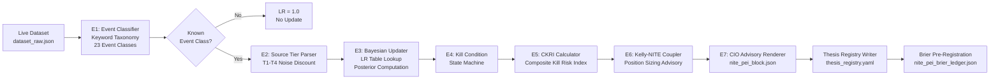
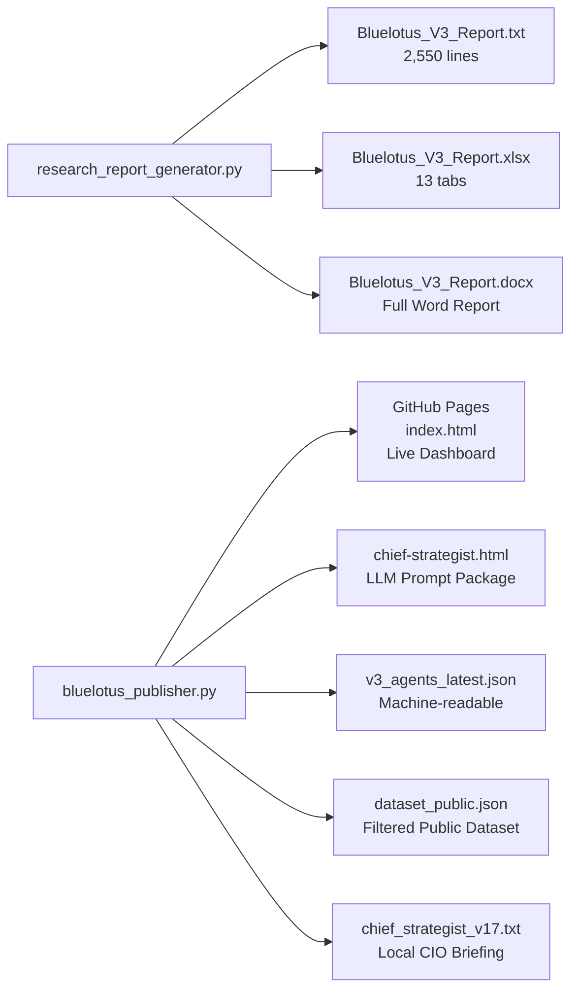
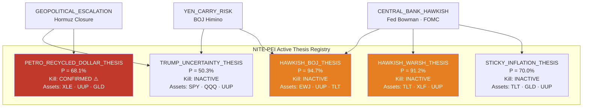
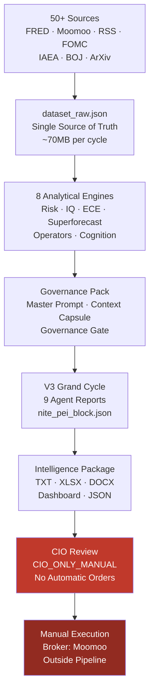

# BlueLotus V3 — Architecture, Workflow & Software Write-Up

**Prepared by:** Dr. Claude Code, Windows Platform Team  
**Co-Authored by:** Dr. Codex, Windows Platform Team  
**Date:** 2026-06-21 SGT  
**Version:** V3.4 (NITE-PEI Live)  
**Execution Authority:** CIO_ONLY_MANUAL — This system advises. The CIO decides and executes manually.

---

## 1. What Is BlueLotus V3?

BlueLotus V3 is a deterministic, institutional-grade investment intelligence platform built for a single-CIO family office. It is not a trading bot. It does not route orders. It does not generate trades automatically.

It is a **research and advisory engine** that:

- Ingests live market data from 50+ sources every 39 minutes
- Applies deterministic (no-LLM) analytical operators across 8 research lenses
- Updates Bayesian thesis probabilities from live news events
- Computes portfolio risk, Kelly sizing, kill conditions, and CKRI
- Publishes a structured Intelligence Package — three main reports plus a live GitHub dashboard — for the CIO to consume before making any manual capital decision

**Core principle:** The pipeline calculates. The Chief Strategist interprets. The CIO decides. The CIO executes manually outside this system.

---

## 2. High-Level Architecture

BlueLotus V3 has five architectural layers:

```
┌─────────────────────────────────────────────────────────┐
│  LAYER 1 — DATA INGESTION (50+ sources, 39-min cycle)   │
├─────────────────────────────────────────────────────────┤
│  LAYER 2 — ANALYTICAL ENGINES (deterministic)           │
│  ECE · STR · PEI · Superforecast · Risk Model           │
├─────────────────────────────────────────────────────────┤
│  LAYER 3 — NITE-PEI (Bayesian Thesis Engine)            │
│  Event Classifier · Bayesian Updater · CKRI · Kelly     │
├─────────────────────────────────────────────────────────┤
│  LAYER 4 — GOVERNANCE (Law & Order)                     │
│  Governance Gate · Scenario Overlay · Operator Layer    │
├─────────────────────────────────────────────────────────┤
│  LAYER 5 — INTELLIGENCE PACKAGE (Reports + Dashboard)   │
│  TXT · XLSX · DOCX · GitHub Pages · chief_strategist    │
└─────────────────────────────────────────────────────────┘
```

---

## 3. Full Pipeline Workflow

```mermaid
flowchart TD
    A([Pipeline Start\n Every 39 Minutes]) --> B

    subgraph LAYER1["LAYER 1 — DATA INGESTION"]
        B[fetch_analyst_targets] --> C[fetch_capital_flow]
        C --> D[fetch_fundamentals]
        D --> E[fetch_treasury_yields]
        E --> F[fetch_cross_market_confirmation]
        F --> G[fetch_portfolio_readonly]
        G --> H[fetch_execution_records]
        H --> I[fetch_corporate_actions]
        I --> J[ingest.py\nSignals · News · Macro]
        J --> K[fetch_tech_publications]
        K --> L[fetch_conference_calendar]
        L --> M[fetch_ceo_appearances]
        M --> N[fetch_ticker_earnings]
        N --> O[fetch_catalyst_calendar]
        O --> P[fetch_historical_prices\n180d lookback]
        P --> Q[historical_backfill_scheduler]
    end

    subgraph EXPORT1["EXPORT & ARCHIVE"]
        Q --> R[export_dataset_raw.json]
        R --> S[archive_dataset_snapshot]
        S --> T[run_freshness_recovery]
        T --> R2[export_dataset_raw v2]
    end

    subgraph LAYER2["LAYER 2 — ANALYTICAL ENGINES"]
        R2 --> U[historical_risk_model\nVaR · Beta · Vol]
        U --> V[seed_cio_decision_journal]
        V --> W[seed_thesis_lifecycle]
        W --> X[record_cio_cognition]
        X --> Y[run_monitoring_alerts]
        Y --> Z[institutional_quant_pipeline\nIQ Readiness Score]
        Z --> AA[run_deterministic_operators\nOperator Layer]
        AA --> AB[bluelotus_superforecast_engine\nBrier Forecasts]
        AB --> AC[forecast_resolution_tracker]
        AC --> AD[forecast_method_comparison]
    end

    subgraph LAYER3["LAYER 3 — GOVERNANCE"]
        AD --> AE[build_chief_strategist_governance_pack]
        AE --> AF[build_chief_strategist_master_prompt]
        AF --> AG[build_cio_context_capsule]
        AG --> AH[governance_gate.py\nApproval Gate]
        AH --> AI[scenario_overlay_engine\nGeopolitical Overlay]
        AI --> AJ[regression_tests]
    end

    subgraph LAYER4["LAYER 4 — REPORT GENERATION"]
        AJ --> AK[research_report_generator.py\nBluelotus_V3_Report TXT·XLSX·DOCX]
        AK --> AL[validate_cio_context_capsule]
        AL --> AM[run_chief_strategist_reply_audit]
        AM --> AN[run_report_regression_audit]
        AN --> AO[acms_cop_db_loader\nSQL Database]
    end

    subgraph LAYER5["LAYER 5 — NITE-PEI ENGINE"]
        AO --> AP[run_v3_grand_cycle\nV3.1–V3.4 Agents\n9 Agent Reports]
        AP --> AQ[run_nite_pei_cycle\nBayesian Thesis Updates\nCKRI · Kelly · Advisory]
    end

    subgraph LAYER6["LAYER 6 — PUBLISH"]
        AQ --> AR[bluelotus_publisher.py]
        AR --> AS[GitHub Pages\nindex.html Dashboard]
        AR --> AT[chief-strategist.html]
        AR --> AU[v3_agents_latest.json]
        AR --> AV[dataset_public.json]
        AR --> AW[chief_strategist_v17.txt]
    end

    style LAYER1 fill:#1a1a2e,color:#fff
    style EXPORT1 fill:#16213e,color:#fff
    style LAYER2 fill:#0f3460,color:#fff
    style LAYER3 fill:#533483,color:#fff
    style LAYER4 fill:#e94560,color:#fff
    style LAYER5 fill:#1a4a6b,color:#fff
    style LAYER6 fill:#2d6a4f,color:#fff
```



---

## 4. Layer-by-Layer Explanation

### Layer 1 — Data Ingestion (15 scripts)

| Script | What It Fetches | Source |
|--------|-----------------|--------|
| `fetch_analyst_targets` | Analyst price targets, Buy/Hold/Sell ratings | Moomoo |
| `fetch_capital_flow` | Institutional Super-Large / Large / Medium flows | Moomoo |
| `fetch_fundamentals` | P/E, P/B, EPS, 52-week range | Moomoo |
| `fetch_treasury_yields` | 2Y, 10Y, 30Y yields, Fed Funds Rate | FRED St. Louis |
| `fetch_cross_market_confirmation` | 57 ETFs: SPY, QQQ, GLD, HYG, VXX, sectors | Moomoo OpenD |
| `fetch_portfolio_readonly` | Live positions, cost basis, P/L, buying power | Moomoo broker (read-only) |
| `fetch_execution_records` | 180d order history, fills, TCA | Moomoo broker (read-only) |
| `fetch_corporate_actions` | Splits, dividends, delistings | Moomoo |
| `ingest.py` | 73,000+ signals: news, macro, geopolitical, Fed speeches | 50+ T1–T4 sources |
| `fetch_tech_publications` | ServeTheHome, TomsHardware, TheRegister, ArsTechnica | RSS |
| `fetch_conference_calendar` | Jensen Huang, Jensen Huang at GTC, AWS Re:Invent | RSS scan |
| `fetch_ceo_appearances` | Elon Musk, Tim Cook, Jensen Huang appearances | Proprietary |
| `fetch_ticker_earnings` | Earnings dates, consensus EPS | Moomoo |
| `fetch_catalyst_calendar` | 14-day imminent catalysts | Composite |
| `fetch_historical_prices` | 180-day OHLCV for VaR computation | Moomoo |

**What this layer produces:** `dataset_raw.json` — the single source of truth for the entire pipeline. All downstream engines read only from this file.

---

### Layer 2 — Analytical Engines

#### 2A. Historical Risk Model
Computes from 180 days of price history:
- **Daily VaR 95/99** per position
- **Annualised Volatility**
- **Beta vs SPY**
- **Maximum Drawdown**
- **Portfolio-level Expected Shortfall**

#### 2B. Institutional Quant Pipeline (IQ Score)
Scores the dataset across 8 process gates:

| Gate | What It Checks |
|------|----------------|
| Data Quality | Source freshness, stale sections |
| Point-in-Time Readiness | Snapshot validity |
| Bias Controls | Sentiment hygiene, dirty headlines |
| Signal Validation | Source tier coverage |
| Risk Model | VaR telemetry presence |
| Portfolio Construction | Mandate compliance |
| Execution Readiness | CIO_ONLY_MANUAL doctrine |
| Monitoring Governance | Alert coverage |

**Output:** IQ Score / 100. Threshold for report release: no hard block, but gates flag WARN or FAIL which appear in the report.

#### 2C. Deterministic Operator Layer (10 operators)

These are hard rules that block or flag actions:

| Operator | What It Enforces |
|----------|------------------|
| `macro_regime` | NEUTRAL / RISK_ON / RISK_OFF from VIX, F&G, yields |
| `gold_thesis` | 8-factor gold safe-haven confirmation |
| `concentration_risk` | HHI and top-3 concentration limits |
| `freshness_governor` | Blocks stale dataset from being used as truth |
| `execution_safety` | Confirms zero order generation |
| `catalyst_intelligence` | Flags missing causal explanations |
| `thesis_lifecycle` | Reviews thesis contradiction count |
| `archive_mismatch` | Guards against archive vs live divergence |
| `portfolio_mandate` | Cash floor, single-name limits, cluster limits |
| `cash_fortress_mode` | Blocks SCALE_IN and SECOND_TRANCHE when cash < threshold |

#### 2D. Superforecast Engine (Brier)
Generates 90-day price forecasts for 200 tickers using two methods:
- `ANALYST_CONSENSUS` — market consensus
- `BLUELOTUS_CONSERVATIVE` — proprietary house view

**Brier Score accountability:** Every forecast is pre-registered. When the horizon matures, the system computes:

```
Brier Score = (P_forecast - Outcome)²
```

Range: 0 (perfect) to 1 (maximally wrong). Tracks whether the system has genuine edge or is just lucky.

#### 2E. Event Correlation Engine (ECE)
Maps 23 themes (AI/SEMIS, QUANTUM, SPACE, GOLD, BANKS, etc.) against live price action and news signals. Produces:
- Sector direction: `PRICE_ACTION_RISK_ON` / `NEUTRAL` / `PRICE_ACTION_RISK_OFF`
- Causal confirmation: whether price move matches its fundamental cause
- Basket move vs prior close

---

### Layer 3 — Governance

#### 3A. Chief Strategist Master Prompt
Locks in the CIO's operating framework. Sets:
- Active strategy (e.g., EVENT_SCOUT_POSITIONING)
- Sleeve rules (per ticker group)
- Kill conditions (14 conditions that block action)
- Source priority hierarchy
- Forbidden behaviours

Every report begins by asserting this prompt. No tactical data overrides it.

#### 3B. CIO Context Capsule
Portable institutional memory. Contains:
- Latest CIO three-step decision record
- Strategic thinking, planning, and execution intent
- Current active framework
- All kill conditions by name

Any LLM receiving the report reads the CIO Context Capsule before anything else.

#### 3C. Governance Gate
Scores the report on 4 gates:
- `execution_safety` — no orders generated
- `concentration_threshold` — position sizes within mandate
- `gold_reconciliation` — gold thesis internally consistent
- `pnl_integrity` — cost basis matches broker

**Release threshold:** `APPROVED_WITH_WARNINGS` allows report to proceed with flagged warnings. `BLOCKED` stops the pipeline.

#### 3D. Scenario Overlay Engine
Scans signals for active geopolitical overlays. When a headline matches a known scenario (e.g., Hormuz closure), it:
- Overrides the base regime posture with a named overlay (e.g., `PEACE_DEAL_FAILURE_RISK`)
- Presents three named scenarios for Monday open (A / B / C)
- Each scenario has a CIO implication

---

### Layer 4 — NITE-PEI Engine

This is the Bayesian thesis probability update engine. It consists of 7 sub-engines.



#### E1 — Event Classifier

Classifies every incoming headline into one of 23 event classes using deterministic keyword matching with boundary-safe regex (no LLM).

**Event classes include:**

| Class | Example Trigger |
|-------|----------------|
| `CENTRAL_BANK_HAWKISH` | "Fed Bowman hawkish", "rate hike", "higher for longer" |
| `CENTRAL_BANK_DOVISH` | "rate cut", "pivot", "accommodative" |
| `GEOPOLITICAL_ESCALATION` | "Hormuz", "airstrike", "sanctions imposed" |
| `GEOPOLITICAL_DEESCALATION` | "ceasefire", "peace deal", "sanctions lifted" |
| `YEN_CARRY_RISK` | "yen carry", "carry unwind", "USD/JPY" |
| `INFLATION_ABOVE_EXPECTATION` | "CPI above", "hotter than expected" |
| `STICKY_INFLATION_THESIS` | CPI trends persistent |
| `LAUNCH_SUCCESS` / `LAUNCH_FAILURE` | SpaceX, Rocket Lab launch outcomes |
| `QUANTUM_MILESTONE` | Qubit record, error rate reduction |
| `EARNINGS_BEAT_MATERIAL` | "EPS beat", "guidance raised" |

**Boundary-safe matching** — the word `war` matches only as a standalone word, not inside `warnings` or `warns`.

**Noise discount by source tier:**

| Tier | Source Type | Noise Discount |
|------|-------------|----------------|
| T1 | Fed FOMC, BOJ Primary, IAEA Official | 0% |
| T2 | Major financial media (Reuters, FT, WSJ) | 10% |
| T3 | Secondary sources | 25% |
| T4 | Noise tier (Zerohedge, social) | 50% |

Unknown sources default to **T3** (conservative, not promoted to T2).

#### E2 — Likelihood Ratio Table

For every combination of `(event_class, thesis_type)`, the YAML table stores:

```yaml
GEOPOLITICAL_ESCALATION:
  GOLD_THESIS:
    lr: 1.40          # Strong positive evidence for gold thesis
    confidence: LOW   # Not yet calibrated (< 10 Brier resolutions)
    calibration_n: 0

  BANK_THESIS:
    lr: 0.85          # Mild negative evidence for bank thesis
```

**LR interpretation:**
- `LR > 1.0` — event is evidence **FOR** the thesis (raises probability)
- `LR = 1.0` — event carries **no information** (no update)
- `LR < 1.0` — event is evidence **AGAINST** the thesis (lowers probability)

#### E3 — Bayesian Updater

**The core equation — Sequential Bayesian Update:**

For each event applied to a thesis:

```
Step 1 — Prior Odds
  prior_odds = P_prior / (1 - P_prior)

Step 2 — Noise-Adjusted LR
  LR_adjusted = 1 + (LR_raw - 1) × (1 - noise_discount)

  Note: This formula preserves the Bayesian neutrality invariant:
    - LR = 1.0 stays 1.0 under any discount
    - LR = 1.4 at 50% discount → 1.2  (weaker positive)
    - LR = 0.6 at 50% discount → 0.8  (weaker negative)
  
  The original naive formula (LR × (1 - discount)) was WRONG:
    - LR = 1.0 at 50% discount → 0.5  (turns neutral into bearish)

Step 3 — Posterior Odds
  posterior_odds = prior_odds × LR_adjusted

Step 4 — Posterior Probability
  P_posterior = posterior_odds / (1 + posterior_odds)

Step 5 — Clamp
  P_posterior = clamp(P_posterior, 0.05, 0.95)
  (prevents mathematical certainty from a single event)

Step 6 — Delta
  ΔP = P_posterior - P_prior
```

**Sequential update:** For multiple events in one cycle, the posterior of event N becomes the prior of event N+1. The Bayesian update is order-dependent.

**Example — Hormuz Closure on GOLD_THESIS:**
```
P_prior     = 0.55
LR_raw      = 1.40   (GEOPOLITICAL_ESCALATION → GOLD_THESIS)
noise_disc  = 0.10   (T2 source)
LR_adjusted = 1 + (1.40 - 1) × (1 - 0.10) = 1.36

prior_odds      = 0.55 / 0.45 = 1.2222
posterior_odds  = 1.2222 × 1.36 = 1.6622
P_posterior     = 1.6622 / 2.6622 = 0.6244
ΔP              = +0.0744
```

#### E4 — Kill Condition State Machine

Each thesis has 2 kill conditions. Each kill condition has:
- `kill_weight` — how much it contributes to CKRI
- `P_kill` — current probability that this condition is being triggered
- `event_classes_that_trigger` — which event classes update it

**State thresholds:**

| P_kill | State |
|--------|-------|
| < 0.10 | INACTIVE |
| 0.10 – 0.35 | WATCH |
| 0.35 – 0.65 | TRIGGERED |
| ≥ 0.65 | CONFIRMED |

When a relevant event fires, `P_kill` is updated to the thesis's current `P_posterior`. If `GEOPOLITICAL_ESCALATION` fires and PETRO_KC_01 lists it as a trigger, the kill condition's P_kill moves to the new posterior probability.

#### E5 — CKRI (Composite Kill Risk Index)

Aggregates all kill conditions across all theses into a single risk number.

```
CKRI Formula:

  weighted_sum = Σ (kill_weight_i × P_kill_i)   for all kill conditions i

  correlation_penalty:
    For each event class that triggers multiple kill conditions,
    add (n_correlated - 1) × 0.15
    (because correlated kills fire together — independent assumption fails)

  CKRI_raw = weighted_sum + correlation_penalty

  CKRI = CKRI_raw / Σ kill_weight_i
  (normalised to [0, 1])
```

**CKRI Zones:**

| CKRI | Zone | CIO Implication |
|------|------|-----------------|
| < 0.20 | CLEAR | Theses intact |
| 0.20 – 0.40 | WATCH | Monitor |
| 0.40 – 0.60 | ELEVATED | Tighten sizing |
| 0.60 – 0.80 | HIGH | Reduce exposure |
| > 0.80 | CRITICAL | Protect capital |

**Current reading: 0.343 → WATCH.**  
Primary contributor: PETRO_KC_01 (P_kill = 0.681, CONFIRMED) driven by Hormuz GEOPOLITICAL_ESCALATION.

#### E6 — Kelly-NITE Coupler

Computes optimal position sizing per thesis using fractional Kelly with a coherence penalty.

**Step 1 — Signal Entropy (H_norm)**

Measures how noisy or contradictory signals are for a thesis's assets. Sourced from `signal_entropy_classifier.py`.

```
H_norm ∈ [0, 1]
H_norm = 0 → pure signal (low noise)
H_norm = 1 → maximum entropy (pure noise)
```

**Step 2 — Branch Dispersion**

From the PEI scenario tree: standard deviation of branch probabilities for the matching thesis.

```
dispersion ∈ [0, 1]
Low dispersion → scenario tree highly concentrated (confident)
High dispersion → scenario outcomes spread out (uncertain)
```

**Step 3 — Coherence Score**

```
coherence = 1 - (H_norm × 0.5 + dispersion × 0.5)
coherence ∈ [0, 1]
```

**Step 4 — Fractional Multiplier**

```
fractional_multiplier = 0.05 + (0.35 - 0.05) × coherence
Range: [0.05, 0.35]
```

At maximum coherence (clean signal, tight scenario tree): multiplier = 0.35 (35% of full Kelly)  
At minimum coherence (pure noise): multiplier = 0.05 (5% of full Kelly — near zero)

**Step 5 — Full Kelly Formula (Thorp)**

```
b = analyst_upside_pct   (e.g. 0.15 for 15% expected return)
p = P_posterior          (thesis probability)
q = 1 - p

f* = (b×p - q) / b       (full Kelly fraction)
f* = max(0, f*)           (never go negative — no shorting signal)
```

**Step 6 — Fractional Kelly**

```
f_kelly = f* × fractional_multiplier

target_usd = NAV_total × f_kelly
delta_usd  = target_usd - current_usd_sleeve
```

This is an advisory only. No capital is moved. The CIO reviews and decides.

#### E7 — CIO Advisory Renderer

Assembles the full `nite_pei_block.json` containing:
- Per-thesis snapshot (P_prior, P_posterior, ΔP, posture, events applied, Bayesian equations)
- CKRI and kill breakdown
- Kelly advisory per thesis
- Contradiction count (P1/P2/P3)
- Event extraction metadata (candidate events, classified events, applied events)

**Posture classification:**

| Condition | Posture |
|-----------|---------|
| ΔP > +0.05 | `THESIS_STRENGTHENED` |
| ΔP < -0.05 | `THESIS_WEAKENED` |
| -0.05 ≤ ΔP ≤ +0.05 | `THESIS_UNCHANGED — MONITOR` |
| Any kill state = CONFIRMED | `KILL_CONDITION_CONFIRMED` |
| P_posterior < 0.20 | `THESIS_RETIRED` |

#### Brier Calibration Loop (Closed-Loop Learning)

Every thesis probability update with events applied writes a **Brier pre-registration record**:

```json
{
  "thesis_id": "HAWKISH_WARSH_THESIS",
  "event_id": "nite_pei_cycle:abc123",
  "p_prior": 0.855,
  "p_posterior": 0.891,
  "delta_p": 0.036,
  "resolution_pending": true,
  "brier_record_id": "NITE_BRIER_HAWKISH_WARSH_THESIS_33162325"
}
```

When the thesis resolves (e.g., Warsh is or is not appointed), the resolution engine:

```
brier_score = (P_posterior - outcome)²

If wrong direction:
  lr_new = 1.0 + (lr_raw - 1.0) × 0.85   (shrink 15% toward neutral)

If correct + brier < 0.10:
  lr_new = 1.0 + (lr_raw - 1.0) × 1.05   (strengthen 5%)

calibration_n += 1
confidence = LOW if n < 10, MEDIUM if n < 30, HIGH if n ≥ 30
```

Over time, the LR table self-calibrates. Initial values are expert-estimated. Mature values are data-derived.

**Duplicate Guard:** The system reads `probability_history` before applying any event. If an `event_id` has already been applied to that thesis, it is skipped. This prevents the same news headline from compounding indefinitely across pipeline cycles.

---

### Layer 5 — V3 Grand Cycle (Agents)

`run_v3_grand_cycle` runs 9 specialist agents against the dataset and produces per-agent JSON reports:

| Agent | Role |
|-------|------|
| STR (Signal-Thesis Resolver) | Resolves signal entropy vs thesis lifecycle |
| PEI (Prospective Event Intelligence) | Scenario tree with branch probabilities |
| CSG (Chief Strategist Governance) | Validates report against governance pack |
| ACMS-COP | Cross-market confirmation patterns |
| V3.1 | Architecture canonical check |
| V3.2 | Benchmark scoring |
| V3.3 | Observation lock |
| V3.4 | Deterministic operator validation |
| CIO Cognition | Records CIO thinking and planning journal |

These agent reports are loaded by the NITE-PEI cycle and embedded in the final `nite_pei_block.json`.

---

### Layer 6 — Intelligence Package (Reports)



---

## 5. Reports Generated — Purpose of Each

### 5A. `Bluelotus_V3_Report.txt`

**Purpose:** The canonical CIO briefing document. Designed to be pasted into a frontier LLM (ChatGPT, Claude, Gemini) as the intelligence context before the CIO asks any question.

**Structure (in order):**
1. Chief Strategist Master Prompt (governance framework)
2. Law & Order Governance Binding (hash-locked)
3. CIO Context Capsule (portable institutional memory)
4. 1-Page CIO Briefing (regime, action, top risks, top opportunities)
5. Breaking Catalyst / Scenario Overlay (geopolitical alert)
6. Gold Safe-Haven Thesis Tracker
7. Executive Summary
8. Dataset Integrity & Source Health
9. Institutional Quant Readiness (IQ Score)
10. Execution Intelligence / Open Orders
11. Deterministic Operator Layer
12. Superforecast / Brier Accountability
13. Market Intelligence Tape (fresh signals by theme)
14. Market Regime
15. Cross-Market Confirmation (57 instruments)
16. Formal Risk Model (VaR, Beta, Vol)
17. CIO Cognition Ledger
18. Portfolio Targets & Thesis Lifecycle
19. Monitoring & Alerts
20. Portfolio, Cash & Mandate Exposure
21. Price Action — Top Movers
22. Sector Rotation — ECE (23 themes)
23. Forward Catalyst Intelligence
24. Institutional Positioning (Options Flow, Capital Flow, CFTC COT)
25. Top-Mover Catalyst Verification
26. Tech Publication Signals
27. Blind Spot Check & Causal Chain Test
28. 8-Lens Research Analysis (per position)
29. Watchlist Opportunity Ranking (186 names)
30. Analyst Target Detail
31. NITE-PEI Thesis Engine (Bayesian updates, CKRI, Kelly)

### 5B. `Bluelotus_V3_Report.xlsx`

**Purpose:** Structured quantitative data for pivot-table analysis, charting, and cross-reference.

**Tabs:**
| Tab | Contents |
|-----|----------|
| Summary | 1-page KPIs |
| Portfolio | Positions, P/L, mandate, action note |
| Watchlist | 186-name 8-lens ranking |
| Superforecast | 90D price targets, probabilities, Brier status |
| Report QA | Data quality gates |
| NITE-PEI Summary | CKRI, thesis probabilities |
| NITE-PEI Thesis Updates | Per-event Bayesian equation steps, source URLs |
| NITE-PEI Kelly | Kelly sizing advisory per thesis |
| Capital Flow | Institutional flow per ticker |
| Options Flow | Unusual large trades |
| Analyst Targets | Full analyst consensus table |
| Risk Model | VaR, Beta, Vol per position |
| Monitoring | Alerts and data lineage |

### 5C. `Bluelotus_V3_Report.docx`

**Purpose:** Formatted institutional report. Suitable for printing or sharing with a board/advisor.

Mirrors the TXT content with tables, coloured headings, hyperlinked source URLs (blue) or breach warnings (red), and Bayesian equation tables formatted in Courier New.

### 5D. GitHub Pages — `index.html` (Live Dashboard)

**URL:** `https://sohweekian.github.io/bluelotus/`

**Purpose:** Live visual dashboard, refreshed every 39 minutes. Shows regime, P/L, open orders, capital flow, sector rotation. Accessible from any device.

### 5E. `chief-strategist.html`

**Purpose:** The LLM prompt package. A Chief Strategist LLM (ChatGPT, Claude, etc.) loads this page and is fully context-aware before the CIO asks a question. Contains the full governance pack, context capsule, and live intelligence payload.

### 5F. `v3_agents_latest.json`

**Purpose:** Machine-readable structured output for downstream API consumption or programmatic analysis. Contains the full NITE-PEI block, all 9 agent reports, cycle ID, and timestamps.

### 5G. `dataset_public.json`

**Purpose:** A filtered version of `dataset_raw.json` with sensitive broker data removed. Used by the GitHub Pages dashboard for live data rendering.

### 5H. `chief_strategist_v17.txt`

**Purpose:** Local CIO briefing file. Saved to disk before GitHub push. Used for offline review.

---

## 6. The Five Active Theses (NITE-PEI Registry)



### Thesis Descriptions

#### TRUMP_UNCERTAINTY_THESIS (P = 50.3%)
**Thesis:** Elevated policy uncertainty from Trump administration (trade, tariffs, geopolitics, Fed chair appointment) creates a sustained risk premium in US equities.  
**Killed by:** Policy clarity (trade deal, neutral Fed), or VIX collapse to pre-2024 levels.

#### PETRO_RECYCLED_DOLLAR_THESIS (P = 68.1%) ⚠️ Kill CONFIRMED
**Thesis:** Oil producers recycle USD surpluses into US Treasuries and equities, sustaining the dollar as global reserve. A Hormuz disruption reverses this flow — oil producers either sell USDs (currency stress) or cannot export at all (flow collapse).  
**Kill CONFIRMED** because GEOPOLITICAL_ESCALATION (Hormuz closure) has raised P_kill to 0.681 on PETRO_KC_01.  
**Killed by:** Sanctions, geopolitical escalation disrupting oil flow, or dollar being rejected as settlement currency.

#### STICKY_INFLATION_THESIS (P = 70.0%)
**Thesis:** US inflation remains above 2% target for a sustained period due to structural supply constraints, fiscal dominance, and wage stickiness. The Fed cannot cut rates.  
**Killed by:** CPI/PCE at 2% for 3+ consecutive months, or Fed explicitly declaring victory.

#### HAWKISH_WARSH_THESIS (P = 91.2%)
**Thesis:** Kevin Warsh (or a Warsh-aligned appointment) as next Fed Chair will tighten monetary policy more aggressively than markets expect. Implication: rates higher for longer, yield curve steepening, growth asset compression.  
**Killed by:** Warsh not appointed, or Warsh pivots dovish after appointment.

#### HAWKISH_BOJ_THESIS (P = 94.7%)
**Thesis:** Bank of Japan is in a structural tightening cycle after decades of ultra-loose policy. As BOJ raises rates, yen carry trades (borrow cheap JPY, buy risky USD assets) unwind, causing a global risk-off shock.  
**Killed by:** BOJ reverses course back to YCC or negative rates, or yen carry fully unwinds without a BOJ hike (premise fails).

---

## 7. How the CIO Benefits from This Software

### 7A. Compressed Intelligence
Every 39 minutes, 73,000+ signals from 50+ sources are compressed into a 2,550-line report that can be read in under 10 minutes. The CIO does not read 73,000 signals manually.

### 7B. Bayesian Accountability
Every thesis has an explicit numerical probability. Every probability change is recorded with the specific event, source URL, LR used, and equation steps. The CIO cannot say "I felt the market was hawkish." The system says "CENTRAL_BANK_HAWKISH event from Fed_Speeches[0] (source: federalreserve.gov) updated HAWKISH_WARSH_THESIS from 0.855 to 0.891 using LR = 1.30, ΔP = +0.036."

### 7C. Kill Condition Governance
The system alerts the CIO when a thesis is being killed before the market confirms it. PETRO_KC_01 went to CONFIRMED on GEOPOLITICAL_ESCALATION. The CIO sees this before Monday open.

### 7D. Operator Blocking
Deterministic operators block 5 dangerous actions: `ADD_RISK_WITHOUT_CATALYST_REVIEW`, `SCALE_IN_ADD`, `SECOND_TRANCHE_ADD`, `ADD_WITHOUT_THESIS_REVIEW`, `USE_ARCHIVE_AS_LIVE_TRUTH`. These are hard rules. The CIO cannot accidentally be advised to scale in during a risk-off period.

### 7E. Source Accountability
Every event that updates a Bayesian probability carries a verified `source_url`, `published_at`, `dataset_key`, and `source_tier`. The CIO can click the URL and verify the headline before accepting the probability update.

### 7F. LLM-Ready Intelligence Package
The TXT and HTML reports are formatted as a complete context capsule for frontier LLMs. The CIO pastes the report into ChatGPT or Claude, and the LLM is fully context-aware — it knows the active strategy, the kill conditions, the sleeve rules, and the live probabilities — before being asked any question.

### 7G. Brier Self-Calibration
The system tracks its own accuracy. Every forecast and every Bayesian probability update is pre-registered. When resolutions arrive, the LR table is updated — making the system more accurate over time. The CIO can see confidence ratings (LOW / MEDIUM / HIGH) and know which LR values are expert-estimated vs data-calibrated.

### 7H. Dual Action Gate (Equity vs Hedge)
VXX and VIXY are governed exclusively by `hedge_action_gate.py`. Equity de-risk signals from CKRI route only to `equity_action_gate.py`. The system never recommends reducing hedges because CKRI is high — doing so would be self-defeating. This is enforced at the code level.

---

## 8. Data Flow Summary



---

## 9. Safety Invariants (Hard-Coded, Never Bypassed)

| Invariant | Where Enforced |
|-----------|---------------|
| `manual_execution_required = True` | Every NITE-PEI output dict |
| `llm_order_generation = False` | Every NITE-PEI module |
| `order_routing_enabled = False` | Publisher, operator layer |
| VXX/VIXY only in `hedge_action_gate` | Code-level separation |
| Append-only ledgers | `portfolio_risk_state.json`, `calibration_audit_log.json`, `nite_pei_brier_ledger.json` |
| Governance hash lock | Every report binds to a governance pack SHA-256 |
| Broker API read-only | Moomoo OpenD `get_market_snapshot` — no write access |
| No LLM in any NITE-PEI engine | Deterministic Python only |

---

## 10. Glossary

| Term | Definition |
|------|-----------|
| NITE-PEI | News Impact & Thesis Engine for Prospective Event Intelligence |
| CKRI | Composite Kill Risk Index — aggregated thesis kill risk score |
| LR | Likelihood Ratio — how much an event updates a thesis probability |
| P_posterior | Updated thesis probability after Bayesian update |
| ΔP | Change in thesis probability from one event |
| Brier Score | Forecast accuracy metric: (forecast - outcome)² |
| Kill Condition | An event that invalidates a thesis's investment premise |
| ECE | Event Correlation Engine — maps themes to price action |
| STR | Signal-Thesis Resolver — signal entropy vs thesis health |
| PEI | Prospective Event Intelligence — scenario tree with probabilities |
| IQ Score | Institutional Quant Readiness score /100 |
| CIO Context Capsule | Portable institutional memory for LLM context injection |
| Governance Gate | Approval/rejection gate before report is released |
| Scenario Overlay | Geopolitical event that overrides base regime posture |
| Fractional Kelly | Kelly formula applied at a fraction (5–35%) for risk management |
| H_norm | Normalised signal entropy (0 = pure signal, 1 = pure noise) |
| Branch Dispersion | Std dev of scenario tree branch probabilities |
| Coherence | Combined signal quality score: 1 - (H_norm×0.5 + dispersion×0.5) |
| Noise Discount | Tier-based LR attenuation toward neutral (T1=0%, T4=50%) |
| T1–T4 | Source tier quality classification |
| Duplicate Guard | Prevents same event_id from updating the same thesis twice |

---

*BlueLotus V3 — Intelligence Package. Advisory only. CIO_ONLY_MANUAL. No automatic execution. No LLM order generation.*  
*Platform Team: Dr. Claude Code + Dr. Codex, Windows Platform Team, 2026-06-21*
